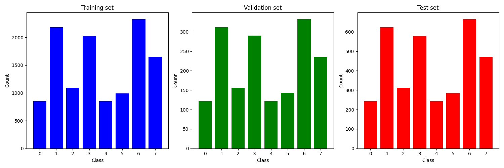

# Semi-Supervised Learning on BloodMNIST Dataset

This project explores semi-supervised learning techniques for medical image classification using the **BloodMNIST** dataset. The main goal was to train a neural network (ResNet-based) capable of learning effectively from **partially labeled data**.

## Project Overview

- **Dataset:** [BloodMNIST](https://medmnist.com/) — a subset of MedMNIST containing blood cell images for classification.
- **Model:** Convolutional Neural Network based on **ResNet architecture**.
- **Approach:** A custom Python class was implemented to handle **semi-supervised training**, combining labeled and unlabeled data during the learning process.

## Dataset – BloodMNIST

The **BloodMNIST** dataset consists of **color images of blood cell samples**, intended for multi-class classification.

- Images: RGB format (color), size 28x28 pixels.
  - **8 distinct classes:**
    - `0`: **basophil**
    - `1`: **eosinophil**
    - `2`: **erythroblast**
    - `3`: **immature granulocytes** (myelocytes, metamyelocytes, promyelocytes)
    - `4`: **lymphocyte**
    - `5`: **monocyte**
    - `6`: **neutrophil**
    - `7`: **platelet**

- Dataset split:
  - Training: **11,959** samples
  - Validation: **1,712** samples
  - Test: **3,421** samples

### Label Distribution

Below is a histogram showing the number of samples per class in the datasets:

## Results

To evaluate the effectiveness of the semi-supervised learning approach, we tested the ResNet-based model using **different fractions of training data**: **5%, 10%, 25%, 50%, 75%, and 100%**.

Each experiment was repeated multiple times to ensure statistical robustness.  
For each data ratio, the **mean accuracy** and **standard deviation** were computed.

### Accuracy vs. Percentage of data used

The plot below illustrates the relationship between the size of the training dataset and classification accuracy:

### Semi-supervised learning: experiment details

In order to reflect real-world conditions with limited labeled data, training was conducted using only a subset of labeled samples, while the remaining data was left unlabeled. Specifically, models were trained with **5%**, **10%**, **25%**, **50%**, and **75%** of the training set labeled, with the remainder used as unlabeled input.

For each configuration, the labeled subset was selected **randomly**, and the impact on model performance was assessed. The figure below illustrates the relationship between the proportion of labeled data and classification accuracy:

### Impact of balanced labeled subsets

In addition to random selection, the effect of the labeled subset composition was also examined. A separate experiment was performed using a **class-balanced labeled subset**, in which an equal number of samples from each class was included.

As shown in the following figure, using a balanced labeled subset did not improved classification performance compared to randomly selected subsets, despite containing the same number of labeled examples:

